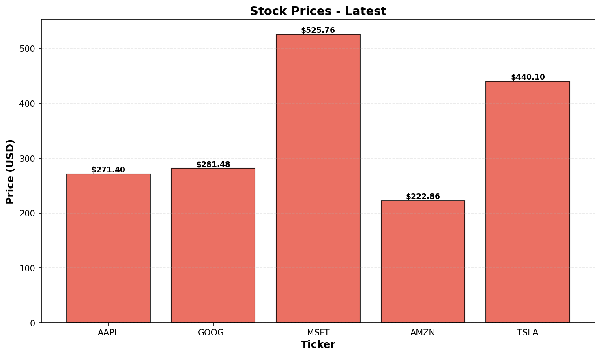

# 株価自動取得パイプライン
<!-- Last Updated: 2026-02-02 -->

## 概要

GitHub Actionsを使用して、平日毎日自動で株価情報を取得・保存・可視化するシステムです。

## 機能

- 📈 Yahoo Finance APIからの株価データ自動取得
- 💾 JSONフォーマットでのデータ保存
- 📊 Matplotlibによるグラフ生成
- 🤖 GitHub Actionsによる自動実行（平日15:00 JST）
- 📝 実行結果のIssue自動投稿

## 最新の株価グラフ



## ディレクトリ構成

```
.
├── dags/                      # データ取得スクリプト
├── scripts/                   # 処理スクリプト
├── data/                      # 株価データ（JSON）
├── charts/                    # 生成されたグラフ
└── .github/workflows/         # GitHub Actions定義
```

## セットアップ

```bash
pip install -r requirements.txt
```

## 手動実行

```bash
python dags/fetch_stock_data.py
python scripts/generate_chart.py
python scripts/update_readme.py
```

## ライセンス

MIT
